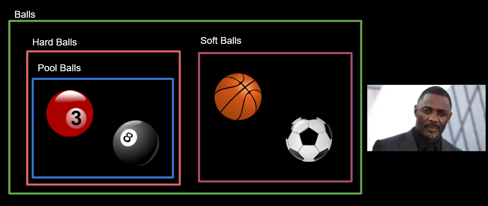
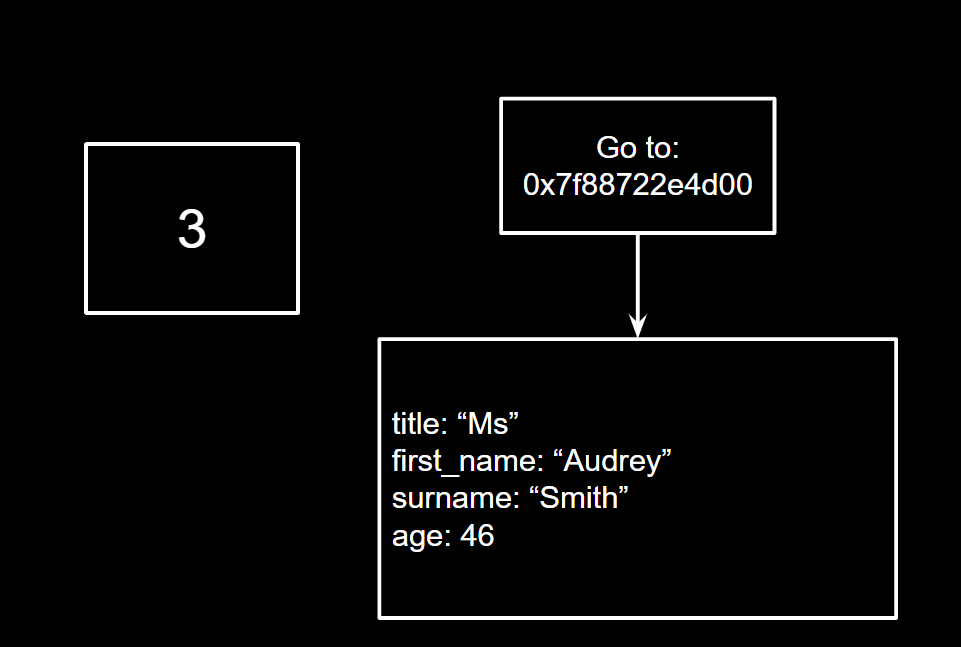

## Lecture 4 - Introduction to OOP


---

## Before we Begin

- Mentoring sessions are no longer.
- Get in contact on the discord server.

---

## Lecture Overview

- Why is OOP useful?
- What is OOP?
- How to use OOP in python.

---

## Why Learn OOP?

Note:
- A lot of the python code out there uses OOP.
- Reusing other people’s code saves time.
- Python is now an object oriented language.

---

## What is OOP?

Note:
- Is a Programming Paradigm
- Focuses on abstraction of code into “classes”
- Encourages self-contained sections of code.

---

## Classes and Objects




Note:

- An object is much like it sounds, but we can have digital ones too. E.g. an email or a post on social media.
- In this example I have 4 objects 
- Classes are like a category of objects.
- Class which represents all balls.
- Subclasses grouping objects by type.
- Idris Elba is not a ball.
- Classes are general representations of a group of objects.

---

## Ball Class

```py
class Ball:
    def __init__(self, is_hard, is_shiny):
        self.is_hard = is_hard
        self.is_shiny = is_shiny

basketball = Ball(False, False)
```

Note:

- Code shown defines a simple python class.
- Everything within the class definition is a part of the class.
- Class constructor is run when the class is instantiated.
- All methods must include a “self” argument which refers to the object itself.

>>>

## More Ball Class

```py
basketball = Ball(False, False)

print(basketball.is_hard)
```

```shell
$ python3 ball.py
False
```

Note:

- We can read the attributes of the object.
- Much like a custom variable in many ways.

---

## Something A Little More Useful

```py
class Person:
    def __init__(self, name, age):
        self.name = name
        self.age = age
```

Note:

- Let’s say we are business that needs to store information about people.
- This is a basic way to store them.

---

## Splitting Name

```py
class Person:
    def __init__(self, title, first_name, surname, age):
        self.title = title
        self.first_name = first_name
        self.surname = surname
        self.age = age
```

Note:

- This is a more granular method of storing those names.
- The granularity of storage is entirely up to you.

---

## Getting the Full Name

```py
person_1 = Person("Ms", "Audrey", "Smith", "46")

print("{} {} {}".format(person_1.title, person_1.first_name, person_1.surname))
```

```shell
$ python3 person.py
Ms Audrey Smith
```

Note:

- Printing out the name is big long.
- We can do better than this.

---

## Changing the Class

```py
class Person:
    def __init__(self, title, first_name, surname, age):
        self.title = title
        self.first_name = first_name
        self.surname = surname
        self.age = age

    def get_name(self):
        return "{} {} {}".format(self.title, self.first_name, self.surname)
```

Notes:

- This is better

>>>

## Getting the Full Name Take 2

```py
person_1 = Person("Ms", "Audrey", "Smith", "46")

print(person_1.get_name())
```

Notes:
- Wow, look at that code length.
- Wow, exactly the same input.

---

## Printing the Class

```py
person_1 = Person("Ms", "Audrey", "Smith", "46")

print(person_1)
```

```shell
$ python3 person.py
<__main__.Person object at 0x7f88722ed00>
```

---

## Pointers



---

## Printing Take 3

```py
def get_name(self):
    return "{} {} {}".format(self.title, self.first_name, self.surname)
```

```py
def __str__(self):
    return "{} {} {}".format(self.title, self.first_name, self.surname)
```

>>>

### Testing

```py
person_1 = Person("Ms", "Audrey", "Smith", "46")

print(person_1)
```

---

## Bad Things to Store

```py
class Person:
    def __init__(self, title, first_name, surname, age):
        self.title = title
        self.first_name = first_name
        self.surname = surname
        self.age = age

    def get_name(self):
        return "{} {} {}".format(self.title, self.first_name, self.surname)
```

>>>

## Better Things to Store

```py
def __init__(self, title, first_name, surname, date_of_birth):
        self.title = title
        self.first_name = first_name
        self.surname = surname
        self.date_of_birth = date_of_birth
```

>>>

## Making Another Audrey

```py
date_1 = datetime.datetime(1975, 1, 1)
person_1 = Person("Ms", "Audrey", "Smith", date_1)

print(person_1)
```

>>>

## Getting Age

```py
def age(self):
    dob = self.date_of_birth
    current_time = datetime.datetime.now()

    difference = current_time.year - dob.year

    return difference
```

>>>

## Getting Audrey's Age

```py
date_1 = datetime.datetime(1975, 1, 1)
person_1 = Person("Ms", "Audrey", "Smith", date_1)

print(person_1)
print(person_1.age())
```

```shell
$ python3 person.py
Ms Audrey Smith
46
```

---

## Different Data

| Ms Trang Difiore     | 47 |
|----------------------|----|
| Master Jerrold Lamar | 16 |
| Miss Sherice Crepeau | 19 |
| Mr Brian Fino        | 43 |
| Ms Lavera Stallworth | 23 |
| Miss Kori Dahmer     | 52 |
| Mr Nigel Zajac       | 45 |
| Ms Ona Lovelace      | 52 |
| Mr Tyron Alaimo      | 45 |
| Ms Genna Goddard     | 35 |
| Mr Sonny Eggleston   | 45 |
| Miss Mabel Freund    | 48 |
| Ms Kelsey Sereno     | 34 |
| Miss Sonya Scherr    | 18 |
| Miss Era Crano       | 54 |
| Mr Cesar Shotts      | 84 |
| Mr Gayle Speir       | 68 |
| Miss Carlita Anson   | 35 |
| Ms Delila Royston    | 53 |
| Ms Gregoria Reiner   | 54 |

>>>

```csv
Ms Trang Difiore, 47
Master Jerrold Lamar, 16
Miss Sherice Crepeau, 19
Mr Brian Fino, 43
Ms Lavera Stallworth, 23
Miss Kori Dahmer, 52
Mr Nigel Zajac, 45
Ms Ona Lovelace, 52
Mr Tyron Alaimo, 45
Ms Genna Goddard, 35
Mr Sonny Eggleston, 45
Miss Mabel Freund, 48
Ms Kelsey Sereno, 34
Miss Sonya Scherr, 18
Miss Era Crano, 54
Mr Cesar Shotts, 84
Mr Gayle Speir, 68
Miss Carlita Anson, 35
Ms Delila Royston, 53
Ms Gregoria Reiner, 54
```

---

## Multipurpose Constructors

```py
def __init__(self, date_of_birth, title=None, first_name=None, surname=None, full_name=None):
    if not (title == None or first_name == None or surname == None):
        self.title = title
        self.first_name = first_name
        self.surname = surname
    elif not (full_name == None):
        name_split = full_name.split(" ")
        self.title = name_split[0]
        self.first_name = name_split[1]
        self.surname = name_split[2]
```

>>>

## Using The New Constructor

```py
date_1 = datetime.datetime(1975, 1, 1)
person_1 = Person(date_1, full_name="Ms Audrey Smith")
person_2 = Person(date_1, "Ms", "Audrey", "Smith")

print("person 1: {}".format(person_1))
print("person 2: {}".format(person_2))

print(person_1.first_name)
```

```shell
$ python3 person.py
person 1: Ms Audrey Smith
person 2: Ms Audrey Smith
Audrey
```

---

### Thanks For Watching :)


